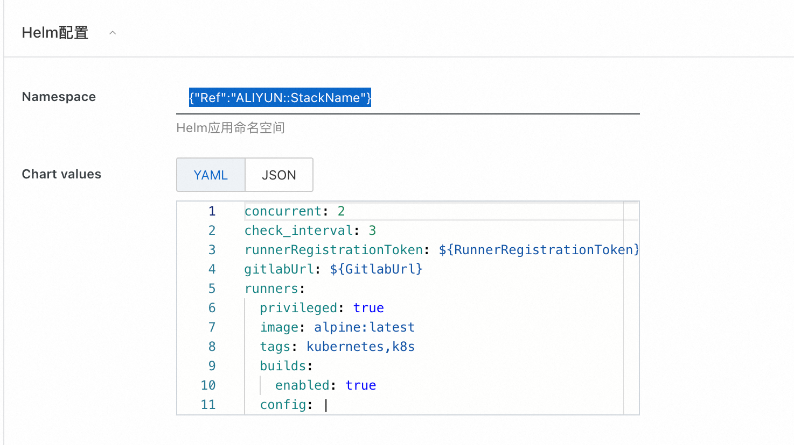
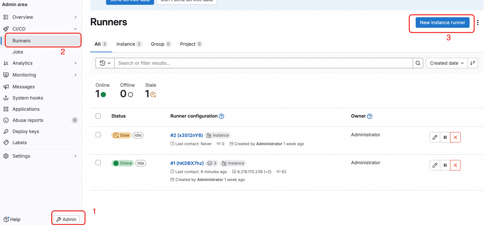
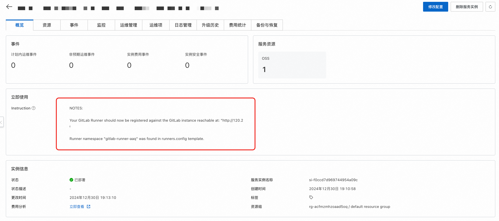

# Gitlab Runner

>**Disclaimer:** This service is provided by a third party. While we endeavor to ensure its security, accuracy, and reliability, we cannot guarantee that it will be entirely free from malfunctions, interruptions, errors, or attacks. Therefore, the company hereby declares: we make no representations, guarantees, or commitments regarding the content, accuracy, completeness, reliability, suitability, or timeliness of this service, and we disclaim any responsibility for any direct or indirect losses or damages that may result from your use of this service; we are not responsible for the content, accuracy, completeness, reliability, suitability, or timeliness of any third-party websites, applications, products, and services that you access through this service, and you assume the risk and responsibility for the consequences of their use; we are not liable for any losses or damages resulting from your use of this service, including but not limited to direct losses, indirect losses, loss of profits, loss of goodwill, loss of data, or other economic losses, even if we have been advised in advance of the possibility of such losses or damages. We reserve the right to modify this disclaimer from time to time, so please check it periodically before using this service. If you have any questions or concerns about this disclaimer or this service, please contact us.

## Overview
JiHu GitLab Runner executes CI/CD jobs defined in JiHu GitLab. JiHu GitLab Runner can run as a single binary, with no language-specific requirements.
JiHu GitLab Runner features include the following:

+ Running multiple jobs in parallel.
+ Using multiple tokens (even per project) on multiple servers.
+ Limiting the number of concurrent jobs per token.
+ Jobs can be run in the following environments:
+ + Locally.
+ + Using Docker containers.
+ + Using Docker containers with jobs executed via SSH.
+ + Using elastic-scaled Docker containers on various cloud and virtualization platforms.
+ + Connected to a remote SSH server.
+ Written in Go and distributed as a single binary with no additional requirements.
+ Supports Bash, PowerShell Core, and Windows PowerShell.
+ Suitable for GNU/Linux, macOS, and Windows (almost any environment that can run Docker).
+ Allows customization of job-running environments.
+ Automatically reloads configuration without needing a restart.
+ Easy-to-use setup supports for Docker, Docker-SSH, Parallels, or SSH running environments.
+ Enables caching of Docker containers.
+ Easily installable as a service for GNU/Linux, macOS, and Windows.
+ Embedded Prometheus metrics HTTP server.
+ Supports monitoring and passing Prometheus metrics and other job-specific data to JiHu GitLab.

This service can rapidly request runner pods based on the features of Alibaba Cloud Container Virtual Node, significantly reducing costs. The default virtual node type requested is:
```yaml
         "alibabacloud.com/compute-qos" = "best-effort"
          "alibabacloud.com/compute-class" = "general-purpose"
```

In actual use, the system requirements configuration for JiHu GitLab Runner depends on:

+ The CPU load required by the CI/CD jobs.
+ The memory usage required by the CI/CD jobs.
+ The number of concurrent CI/CD jobs.
+ The number of projects under development.
+ The number of developers expected to work simultaneously.

## Prerequisites
<font style="color:rgb(51, 51, 51);">Deploying the Gitlab Runner Community Edition service instance requires access and the ability to create certain Alibaba Cloud resources. Therefore, your account needs to include permissions for the following resources.</font> <font style="color:rgb(51, 51, 51);"> **Note**</font><font style="color:rgb(51, 51, 51);">: These permissions need to be added only if your account is a RAM account.</font>

| <font style="color:rgb(51, 51, 51);">Permission Policy Name</font>          | <font style="color:rgb(51, 51, 51);">Remarks</font>                     |
|-----------------------------------------------------------------------------|-------------------------------------------------------------------------|
| <font style="color:rgb(51, 51, 51);">AliyunECSFullAccess</font>             | <font style="color:rgb(51, 51, 51);">Permission to manage Elastic Compute Service (ECS)</font>  |
| <font style="color:rgb(51, 51, 51);">AliyunVPCFullAccess</font>             | <font style="color:rgb(51, 51, 51);">Permission to manage Virtual Private Cloud (VPC)</font>  |
| <font style="color:rgb(51, 51, 51);">AliyunROSFullAccess</font>             | <font style="color:rgb(51, 51, 51);">Permission to manage Resource Orchestration Service (ROS)</font>  |
| <font style="color:rgb(51, 51, 51);">AliyunComputeNestUserFullAccess</font> | <font style="color:rgb(51, 51, 51);">Permission to manage Compute Nest Services from a user-side perspective</font>  |
| <font style="color:rgb(51, 51, 51);">AliyunComputeOSSFullAccess</font>      | <font style="color:rgb(51, 51, 51);">Permission to manage Object Storage Service (OSS)</font>  |
| <font style="color:rgb(51, 51, 51);">AliyunCSFullAccess</font>              | <font style="color:rgb(51, 51, 51);">Permission to manage Container Service (CS)</font>  |

## Billing Information
<font style="color:rgb(51, 51, 51);"> The costs associated with deploying the Community Edition on Compute Nest mainly involve:</font>

+ <font style="color:rgb(51, 51, 51);">The selected vCPU and memory specifications</font>
+ <font style="color:rgb(51, 51, 51);">System disk type and capacity</font>
+ <font style="color:rgb(51, 51, 51);">Public bandwidth</font>


## Deployment Architecture


### Deployment Parameters
When creating a service instance, you need to configure the service instance information. The following outlines the detailed information of Jupyterhub service instance input parameters, divided into existing ACK clusters and new ACK clusters.
#### Existing ACK Cluster

When the parameter "Create new ACK cluster" is set to no, it means you already have an ACK cluster, and the following parameters need to be filled out.

| Parameter Group | Parameter | Example                          | Description                                 |
|-----------------|-----------|----------------------------------|---------------------------------------------|
| Service Instance Name   |           | test                             | Name of the instance                        |
| Region            |           | East China 1 (Hangzhou)         | Select the region of the service instance, preferably close by for better network latency. |
| Create new ACK cluster   | Yes/No      | No                            | Selecting No indicates an existing ACK cluster, no need to create a new one |
| Create new ACK cluster   | K8s Cluster ID | ccde6deb0f612402786e611a7e1230d | Select the ID of an existing cluster within the region |
| Application Configuration | Domain         | jupyter.mycompany.com           | The domain to access                         |
| Application Configuration | Helm Configuration  | {}                              | Detailed Helm configuration reference: https://gitlab.com/gitlab-org/charts/gitlab-runner/blob/main/values.yaml |

#### New ACK Cluster

| Parameter Group           | Parameter               | Example                      | Description                                                                 |
|---------------------------|-------------------------|------------------------------|-----------------------------------------------------------------------------|
| Service Instance Name     |                         | test                         | Name of the instance                                                        |
| Region                    |                         | East China 1 (Hangzhou)      | Select the region of the service instance, preferably close by for better network latency. |
| Create new ACK cluster    |                         | Yes                          | Selecting Yes indicates creating a new ACK cluster                          |
| Billing Type Configuration| Billing Type            | Pay-As-You-Go or Subscription |                                                                            |
| Basic Configuration       | Availability Zone       | Zone I                       | Different availability zones within the region                             |
| Basic Configuration       | VPC Instance ID         | vpc-xxx                      | Select an available VPC within the region. If none exists, a new one can be created.  |
| Basic Configuration       | Subnet Instance ID      | vsw-xxx                      | Select a subnet within the selected VPC, influenced by the availability zone. If none exists, a new one can be created.  |
| Basic Configuration       | Instance Password       | ********                     | Set the instance password. The password must be between 8-30 characters and include three of the following: uppercase letters, lowercase letters, numbers, special characters from ()~!@#$%^&*-+={}[]:;'<>,.?/. |
| Kubernetes Configuration  | Worker Node Specification | ecs.g6.large                | Choose the ECS instance with the desired number of CPU cores and memory, to be used as a Kubernetes node |
| Kubernetes Configuration  | Worker Node System Disk Type  | ESSD Cloud Disk         | Choose the system disk type for the Kubernetes cluster Worker nodes        |
| Kubernetes Configuration  | Worker Node System Disk Size (GB) | 120             | Set the system disk size for Worker nodes, measured in GB                |
| Kubernetes Configuration  | ACK Network Plugin       | Flannel                      | Choose a network plugin for the ACK cluster, either Flannel or Terway, which affects the pod network settings below |
| Kubernetes Configuration  | Pod Network CIDR         | 10.0.0.0/16                  | The Pod network range for ACK. Required when using Flannel. Please provide a valid private network segment, such as 10.0.0.0/8, 172.16-31.0.0/12-16, or 192.168.0.0/16, not overlapping with existing VPC or Kubernetes clusters. |
| Kubernetes Configuration  | Pod Subnet Instance ID   | vsw-xx                       | The Pod subnet instance ID for ACK. Required when using Terway. Choose a subnet with a mask no larger than 19. |
| Kubernetes Configuration  | Service CIDR             | 172.16.0.0/16                | The Service network range for ACK. Choose from: 10.0.0.0/16-24, 172.16-31.0.0/16-24, 192.168.0.0/16-24, ensuring no overlap with existing VPC or Kubernetes clusters. |
| Application Configuration  | Domain                  | jupyter.mycompany.com        | The domain to access                                                       |
| Application Configuration  | Helm Configuration      | {}                           | Detailed Helm configuration reference: https://gitlab.com/gitlab-org/charts/gitlab-runner/blob/main/values.yaml |

## Deployment Process
1. Visit the Compute Nest [deployment link](https://computenest.console.aliyun.com/service/instance/create/default?type=user&ServiceName=Gitlab%20Runner%E7%A4%BE%E5%8C%BA%E7%89%88) and fill in the deployment parameters as prompted.
2. Specify whether to create a new cluster or select an existing one
3. Fill in the Helm configuration. The first parameter is the namespace where the Helm application will run. The default value {"Ref":"ALIYUN::StackName"} means using the Compute Nest instance name as the namespace.
4. The second parameter is the Chart values, which are the parameters needed to run the Helm application. **Note that you must replace the GitlabUrl and GitlabRunnerToken here.**
5. GitlabUrl is the external address of your Gitlab, while GitlabRunnerToken is the token registered with Gitlab for the runner, used for authentication between Gitlab and Runner. Refer to the following two images to obtain the token:  for creating a new Runner and 
6. An illustration of successfully creating a Runner registered with Gitlab is shown here. Note that once the current page is closed, the token cannot be viewed again: 
7. In the default configuration values, 'concurrent' represents the number of concurrent jobs. If you have not deployed your own Gitlab, you can use the official address by entering: https://gitlab.com.
8. **Note: Both the manager node of Gitlab Runner and the scheduled job nodes operate under {{.Release.Namespace}}. Please do not modify this configuration, or it will cause permission issues.**
9. For adjustments to other parameters, refer to the [official documentation](https://gitlab.com/gitlab-org/charts/gitlab-runner/blob/main/values.yaml).
10. Click to create immediately and wait for the service instance to be deployed
11. Once the service instance deployment is complete, click on the instance ID to enter the detail page. As shown, the deployment has been successfully completed
12. You can now proceed to create and execute pipelines in the original Gitlab.
## Advanced Configuration

### Dynamically Modify Helm Values (The Following Advanced Configurations Rely on This Functionality)
1. Click to enter the service instance details page, then click "Modify Configuration" in the top right corner. 
2. Choose to modify the Helm configuration. 
3. Modify the deployment parameters and reconfigure. 
4. Wait for the instance to be reconfigured to achieve dynamic Helm updates.

### Configure OSS Cache for Pipeline Acceleration
This cache is for pipeline job caching, such as caching Python dependencies.

#### Configuration Section
1. First, you need to create an OSS-related RAM user and grant this user OSS-related permissions, and save its Access Key (AK) and Secret Key (SK). You can refer to this [document](https://help.aliyun.com/zh/ram/use-cases/use-ram-to-manage-oss-permissions?spm=a2c4g.11186623.help-menu-search-28625.d_7) for related RAM AK and SK creation.
2. Click to enter the service instance details page, then click "Modify Configuration" in the top right corner. 
3. Choose to modify the Helm configuration. 
4. Find the line `[[runners]]`, and add the following configuration in its sub-columns:
```toml
[runners.cache]
  type = "s3"
  shared = true
  [runners.cache.s3]
    #example："oss-ap-southeast-1.aliyuncs.com"
    ServerAddress = "${ServerAddress}"
    AccessKey = "LTAxxxxx"
    SecretKey = "0KPDxxxx"
    #example:"gitlab-runner"
    BucketName = "${BucketName}"
    #example:"ap-southeast-1"
    BucketLocation = "${Region}"
    Insecure = false
```
### Implement Dynamic Scaling of Runner Manager Nodes via HPA Configuration
A default HPA rule is prepared in the service creation interface
```yaml
hpa:
  minReplicas: 2
  maxReplicas: 10
  metrics:
    - type: Resource
      resource:
        name: cpu
        target:
          averageUtilization: 10
          type: Utilization
```

The corresponding explanations are as follows:
minReplicas: 2: The minimum number of replicas is set to 2. This means that even with low load, the Deployment will maintain at least 2 running replicas.

maxReplicas: 10: The maximum number of replicas is set to 10. This is the highest number of replicas HPA can scale to automatically in response to high load.
target.averageUtilization: 10: The target average utilization is set to 10%. This means that HPA will try to keep the average CPU metric at 10%. If the jobs per Pod exceed 10%, HPA will tend to increase the replicas; if lower than 10%, HPA will reduce the replicas but not below the minReplicas setting.

These settings mean that HPA will adjust the number of Pods based on CPU utilization, ensuring dynamic scaling between 2 and 10 replicas to meet processing demands.
More HPA tutorials can be found at: https://help.aliyun.com/zh/ack/hpa

### Using ECI + Spot for Cost-efficient Elastic Worker Nodes in ACK Scenarios

Select the corresponding ACK cluster, go to Operations Management -> Component Management -> Install ACK Virtual Node to enable ECI elasticity. Subsequent runner jobs will be executed directly on virtual nodes.
If you also want the runner manager nodes to run on spot instances, the following configuration can be utilized.
By adding the following annotation, pods in ACK can register using virtual nodes. Note that the parameter level is the same as runnerRegistrationToken.
```yaml
podLabels: 
  alibabacloud.com/eci: "true"
```

As shown in the figure:

Note: If ACS cluster is selected, nodes will default to virtual nodes without additional configuration required.

To further limit the resources consumed by the runner manager, refer to the following settings, which remain at the top level:
```yaml
resources:
  requests:
    cpu: "250m"
    memory: "256Mi"
  limits:
    cpu: "1000m"
    memory: "512Mi"
```

### Image Build Example

#### Uploading Images Built by Gitlab Runner to an Image Repository
If you do not have an image repository, you can refer to Alibaba Cloud's ACR service to create one.
Reference documentation: https://help.aliyun.com/zh/acr/user-guide/create-a-container-registry-enterprise-edition-instance?spm=a2c4g.11186623.help-menu-60716.d_2_0_0.7f991ecdmE3Nmr

A common scenario for using Gitlab Runner is for Docker image building. Currently, two general solutions exist:
1. Docker in Docker.
2. Kaniko.
   Since Kaniko reduces virtualization overhead and performs more efficiently, only the second solution is exemplified here.
3. Note: Specify the running image as: registry.cn-hangzhou.aliyuncs.com/acs-demo-ns/kaniko-executor:v1.21.0-amd64-debug
```yaml
build-job:       # This job runs in the build stage, which runs first.
  stage: build
  cache:
    key: test
    paths:
      - node_modules/
      - .cache/
  image:
    name: registry.cn-hangzhou.aliyuncs.com/acs-demo-ns/kaniko-executor:v1.21.0-amd64-debug
    entrypoint: [""] 
  script:
    - echo "{\"auths\":{\"${ACR_REGISTRY}\":{\"auth\":\"$(printf "%s:%s" "${CI_REGISTRY_USER}" "${CI_REGISTRY_PASSWORD}" | base64 | tr -d '\n')\"}}}" > /kaniko/.docker/config.json
    - /kaniko/executor
      --context "$CI_PROJECT_DIR"
      --dockerfile "$CI_PROJECT_DIR/Dockerfile"
      --destination ${ACR_REGISTRY}:latest
```

Explanation:
CI_REGISTRY_USER, CI_REGISTRY_PASSWORD, and ACR_REGISTRY are parameters set as secrets or environment variables. They can be added here:

$CI_PROJECT_DIR represents the current project path.
The parameter --context specifies the build directory.
--destination specifies the image repository address.
More Kaniko parameters can be referenced here: https://github.com/GoogleContainerTools/kaniko

### Image Build Cache Configuration
This service instance has pre-installed OSS. When writing the pipeline for building images, you can set the cache location. You can specify cache keys and paths to determine the cache path.
```yaml

build-job:       # This job runs in the build stage, which runs first.
  stage: build
  cache:
    key: test
    paths:
      - node_modules/
      - .cache/
```

Here is a complete runner configuration that can be used:
```yaml
stages:          # List of stages for jobs, and their order of execution
  - build
  - test
  - deploy
variables:
  KUBERNETES_POD_LABELS_1: "alibabacloud.com/compute-class=general-purpose"
  KUBERNETES_POD_LABELS_2: "alibabacloud.com/compute-qos=best-effort"


build-job:       # This job runs in the build stage, which runs first.
  stage: build
  cache:
    key: test
    paths:
      - node_modules/
      - .cache/
  image:
    name: registry.cn-hangzhou.aliyuncs.com/acs-demo-ns/kaniko-executor:v1.21.0-amd64-debug
    entrypoint: [""] 
  script:
    - echo "{\"auths\":{\"${ACR_REGISTRY}\":{\"auth\":\"$(printf "%s:%s" "${CI_REGISTRY_USER}" "${CI_REGISTRY_PASSWORD}" | base64 | tr -d '\n')\"}}}" > /kaniko/.docker/config.json
    - /kaniko/executor
      --context "$CI_PROJECT_DIR"
      --dockerfile "$CI_PROJECT_DIR/Dockerfile"
      --destination ${ACR_REGISTRY}:latest
```

### Complete Values Reference
https://gitlab.com/gitlab-org/charts/gitlab-runner/blob/main/values.yaml
This can be used to implement more advanced configurations, such as enabling dynamic scaling of Runner manager nodes via HPA.

Official configuration documentation for Gitlab Runner can be referenced here: https://gitlab.cn/docs/runner/configuration/
