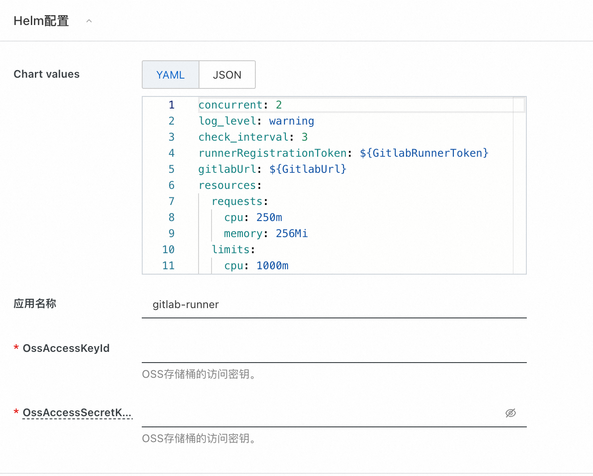
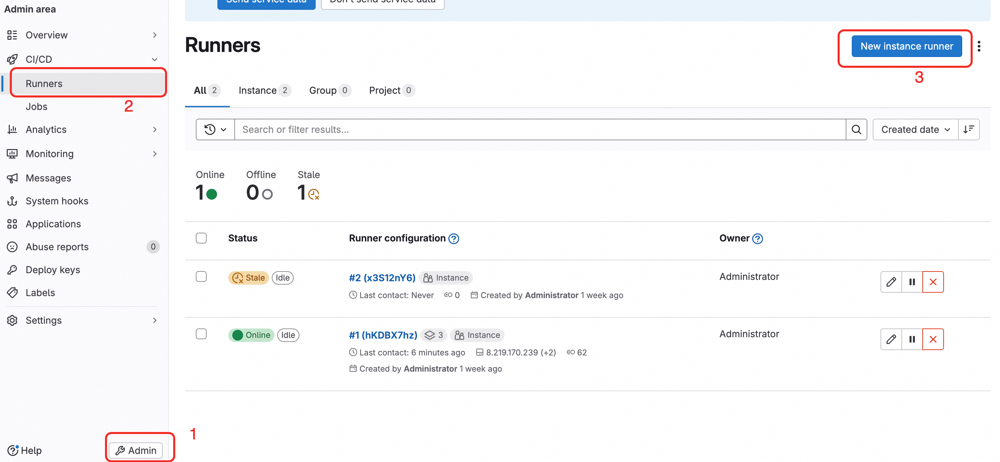
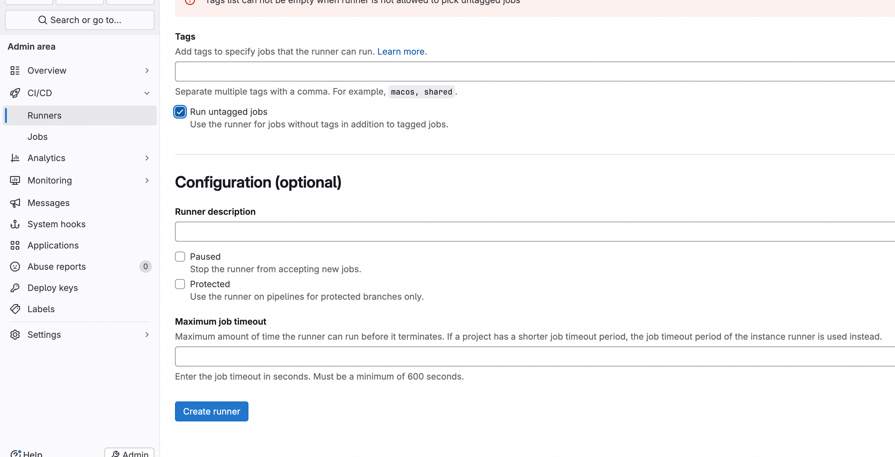
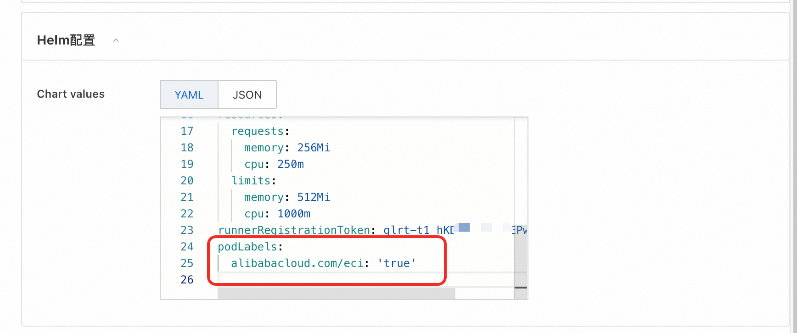
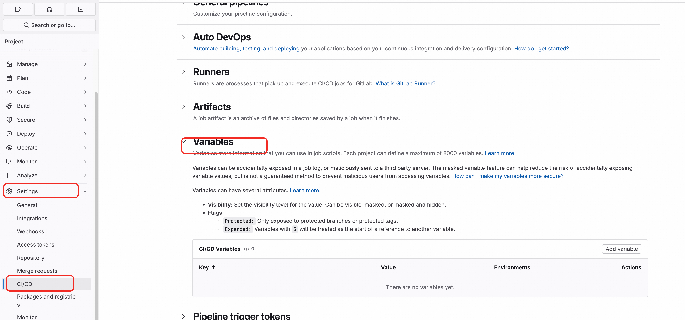

# Gitlab Runner

>**免责声明：**本服务由第三方提供，我们尽力确保其安全性、准确性和可靠性，但无法保证其完全免于故障、中断、错误或攻击。因此，本公司在此声明：对于本服务的内容、准确性、完整性、可靠性、适用性以及及时性不作任何陈述、保证或承诺，不对您使用本服务所产生的任何直接或间接的损失或损害承担任何责任；对于您通过本服务访问的第三方网站、应用程序、产品和服务，不对其内容、准确性、完整性、可靠性、适用性以及及时性承担任何责任，您应自行承担使用后果产生的风险和责任；对于因您使用本服务而产生的任何损失、损害，包括但不限于直接损失、间接损失、利润损失、商誉损失、数据损失或其他经济损失，不承担任何责任，即使本公司事先已被告知可能存在此类损失或损害的可能性；我们保留不时修改本声明的权利，因此请您在使用本服务前定期检查本声明。如果您对本声明或本服务存在任何问题或疑问，请联系我们。

## 概述
极狐GitLab Runner 运行定义在极狐GitLab 中的 CI/CD 作业。极狐GitLab Runner 可以以单个二进制文件运行，且没有特定于语言的要求。
极狐GitLab Runner 的特性如下。

+ 并行运行多个作业。
+ 在多个服务器上使用多个令牌（甚至每个项目）。
+ 限制每个令牌的并发作业数。
+ 作业可以在以下环境运行作业：
+ + 本地。
+ + 使用 Docker 容器。
+ + 使用 Docker 容器并通过 SSH 执行作业。
+ + 在不同的云和虚拟化平台上使用弹性伸缩的 Docker 容器。
+ + 连接到远程 SSH 服务器。
+ 使用 Go 语言编写并作为单个二进制文件分发，没有任何其它需求。
+ 支持 Bash、PowerShell Core 和 Windows PowerShell。
+ 适用于 GNU/Linux、macOS 和 Windows（可以运行 Docker 的几乎任何环境）。
+ 允许自定义作业运行环境。
+ 无需重启即可自动重新加载配置。
+ 易于使用的设置，支持 Docker、Docker-SSH、Parallels 或 SSH 运行环境。
+ 启用缓存 Docker 容器。
+ 轻松安装为 GNU/Linux、macOS 和 Windows 的服务。
+ 嵌入式 Prometheus 指标 HTTP 服务器。
+ 支持被监控，并将 Prometheus 指标和其他特定作业的数据传递给极狐GitLab。

本服务可基于阿里云容器虚拟节点的功能极快速地申请runner pod，且极大减少成本。默认申请的虚拟节点类型为：
```yaml
         "alibabacloud.com/compute-qos" = "best-effort"
          "alibabacloud.com/compute-class" = "general-purpose"
```

在实际使用中，极狐GitLab Runner 的系统需求配置取决于：

+ CI/CD 作业所需的 CPU 负载。
+ CI/CD 作业所需的内存使用量。
+ CI/CD 作业的并发数量。
+ 开发中的项目数量。
+ 预期同时工作的开发人员数量。

## 前提条件
<font style="color:rgb(51, 51, 51);">部署Gitlab Runner社区版服务实例，需要对部分阿里云资源进行访问和创建操作。因此您的账号需要包含如下资源的权限。</font><font style="color:rgb(51, 51, 51);"> </font>**<font style="color:rgb(51, 51, 51);">说明</font>**<font style="color:rgb(51, 51, 51);">：当您的账号是RAM账号时，才需要添加此权限。</font>

| <font style="color:rgb(51, 51, 51);">权限策略名称</font>                          | <font style="color:rgb(51, 51, 51);">备注</font>                         |
|-----------------------------------------------------------------------------|------------------------------------------------------------------------|
| <font style="color:rgb(51, 51, 51);">AliyunECSFullAccess</font>             | <font style="color:rgb(51, 51, 51);">管理云服务器服务（ECS）的权限</font>           |
| <font style="color:rgb(51, 51, 51);">AliyunVPCFullAccess</font>             | <font style="color:rgb(51, 51, 51);">管理专有网络（VPC）的权限</font>             |
| <font style="color:rgb(51, 51, 51);">AliyunROSFullAccess</font>             | <font style="color:rgb(51, 51, 51);">管理资源编排服务（ROS）的权限</font>           |
| <font style="color:rgb(51, 51, 51);">AliyunComputeNestUserFullAccess</font> | <font style="color:rgb(51, 51, 51);">管理计算巢服务（ComputeNest）的用户侧权限</font> |
| <font style="color:rgb(51, 51, 51);">AliyunComputeOSSFullAccess</font>      | <font style="color:rgb(51, 51, 51);">管理Oss的权限权限</font>                 |
| <font style="color:rgb(51, 51, 51);">AliyunCSFullAccess</font>      | <font style="color:rgb(51, 51, 51);">管理容器服务(CS)的权限</font>                 |


## 计费说明
<font style="color:rgb(51, 51, 51);"> 社区版在计算巢部署的费用主要涉及：</font>

+ <font style="color:rgb(51, 51, 51);">所选vCPU与内存规格</font>
+ <font style="color:rgb(51, 51, 51);">系统盘类型及容量</font>
+ <font style="color:rgb(51, 51, 51);">公网带宽</font>

## 部署架构


### 部署参数说明
您在创建服务实例的过程中，需要配置服务实例信息。下文介绍Jupyterhub服务实例输入参数的详细信息,分为已有ack集群和新建ack集群两种。
#### 已有ack集群

是否新建ack集群参数选择否时，代表现在已有ack集群，此时需要填写以下参数。

| 参数组       | 参数项       | 示例                              | 说明                                                                                   |
|-----------|-----------|---------------------------------|--------------------------------------------------------------------------------------|
| 服务实例名称    |           | test                            | 实例的名称                                                                                |
| 地域        |           | 华东1（杭州）                         | 选中服务实例的地域，建议就近选中，以获取更好的网络延时。                                                         |
| 是否新建ack集群 | 是否新建ack集群 | 否                               | 选择否代表已有ack集群，不用新建                                                                    |
| 是否新建ack集群 | K8s集群ID   | ccde6deb0f612402786e611a7e1230d | 根据地域选择地域中用户已有的集群id                                                                   |
| 应用配置      | 域名        | jupyter.mycompany.com           | 访问的域名                                                                                |
| 应用配置      | OSS访问凭证   | AccessKey                       | Oss访问凭证，需要有oss读写权限。                                                                  |
| 应用配置      | OSS访问凭证秘钥 | secret key                      | Oss访问凭证秘钥。                                                                           |
| 应用配置      | Helm 配置   | {}                              | helm的配置详细参考https://gitlab.com/gitlab-org/charts/gitlab-runner/blob/main/values.yaml｜ |

#### 新建ack集群

| 参数组          | 参数项               | 示例                    | 说明                                                                                                                                    |
|--------------|-------------------|-----------------------|---------------------------------------------------------------------------------------------------------------------------------------|
| 服务实例名称       |                   | test                  | 实例的名称                                                                                                                                 |
| 地域           |                   | 华东1（杭州）               | 选中服务实例的地域，建议就近选中，以获取更好的网络延时。                                                                                                          |
| 是否新建ack集群    |                   | 是                     | 选择是代表新建ack集群                                                                                                                          |
| 付费类型配置       | 付费类型              | 按量付费 或 包年包月           |                                                                                                                                       |
| 基础配置         | 可用区               | 可用区I                  | 地域下的不同可用区域                                                                                                                            |
| 基础配置         | 专有网络VPC实例ID       | vpc-xxx               | 选择地域下可用的vpc,不存在可以新建                                                                                                                   |
| 基础配置         | 交换机实例ID           | vsw-xxx               | 选择vpc下的vsw，这个vsw筛选会受上面不同可用区域影响，不存在可以新建                                                                                                |
| 基础配置         | 实例密码              | ********              | 设置实例密码。长度8~30个字符，必须包含三项（大写字母、小写字母、数字、()~!@#$%^&*-+={}[]:;'<>,.?/ 中的特殊符号）                                                              |
| Kubernetes配置 | Worker节点规格        | 	ecs.g6.large         | 选择对应cpu核数和内存大小的ecs实例，用作k8s节点                                                                                                          |
| Kubernetes配置 | Worker 系统盘磁盘类型    | ESSD云盘                | 选择k8s集群Worker节点使用的系统盘磁盘类型                                                                                                             |
| Kubernetes配置 | Worker节点系统盘大小(GB) | 120                   | 设置Worker节点系统盘大小，单位为GB                                                                                                                 |
| Kubernetes配置 | ack网络插件           | Flannel               | ack集群对应的网络插件，可以选择Flannel或者Terway，网络插件不同，下面设置的pod网络参数不同                                                                                |
| Kubernetes配置 | Pod 网络 CIDR       | 10.0.0.0/16           | ack Pod网络段，网络插件为Flannel时必填，请填写有效的私有网段，即以下网段及其子网：10.0.0.0/8，172.16-31.0.0/12-16，192.168.0.0/16，不能与 VPC 及 VPC 内已有 Kubernetes 集群使用的网段重复。 |
| Kubernetes配置 | pod交换机实例ID        | vsw-xx                | ack Pod交换机实例id，网络插件为Terway时必填，建议选择网段掩码不大于 19 的虚拟交换机                                                                                   |
| Kubernetes配置 | Service CIDR      | 172.16.0.0/16         | ack Service网络段, 可选范围：10.0.0.0/16-24，172.16-31.0.0/16-24，192.168.0.0/16-24,不能与 VPC 及 VPC 内已有 Kubernetes 集群使用的网段重复。                     |
| 应用配置         | 域名                | jupyter.mycompany.com | 访问的域名                                                                                                                                 |
| 应用配置         | OSS访问凭证           | AccessKey             | Oss访问凭证，需要有oss读写权限。                                                                                                                   |
| 应用配置         | OSS访问凭证秘钥         | secret key            | Oss访问凭证秘钥。                                                                                                                            |
| 应用配置         | Helm 配置           | {}                    | helm的配置详细参考https://gitlab.com/gitlab-org/charts/gitlab-runner/blob/main/values.yaml｜                                                  |

## 参数说明
| <font style="color:rgb(51, 51, 51);">参数组</font> | <font style="color:rgb(51, 51, 51);">参数项</font> | <font style="color:rgb(51, 51, 51);">说明</font> |
| --- | --- | --- |
| <font style="color:rgb(51, 51, 51);">服务实例</font> | <font style="color:rgb(51, 51, 51);">服务实例名称</font> | <font style="color:rgb(51, 51, 51);">长度不超过64个字符，必须以英文字母开头，可包含数字、英文字母、短划线（-）和下划线（_）</font> |
| | <font style="color:rgb(51, 51, 51);">地域</font> | <font style="color:rgb(51, 51, 51);">服务实例部署的地域</font> |
| | <font style="color:rgb(51, 51, 51);">付费类型</font> | <font style="color:rgb(51, 51, 51);">资源的计费类型：按量付费和包年包月</font> |
| <font style="color:rgb(51, 51, 51);">ECS实例配置</font> | <font style="color:rgb(51, 51, 51);">实例类型</font> | <font style="color:rgb(51, 51, 51);">可用区下可以使用的实例规格</font> |
| | <font style="color:rgb(51, 51, 51);">实例密码</font> | <font style="color:rgb(51, 51, 51);">长度8-30，必须包含三项（大写字母、小写字母、数字、 ()`~!@#$%^&*-+=|{}[]:;'<>,.?/ 中的特殊符号）</font> |
| <font style="color:rgb(51, 51, 51);">网络配置</font> | <font style="color:rgb(51, 51, 51);">可用区</font> | <font style="color:rgb(51, 51, 51);">ECS实例所在可用区</font> |
| | <font style="color:rgb(51, 51, 51);">VPC ID</font> | <font style="color:rgb(51, 51, 51);">资源所在VPC</font> |
| | <font style="color:rgb(51, 51, 51);">交换机ID</font> | <font style="color:rgb(51, 51, 51);">资源所在交换机</font> |


## 部署流程
1. 访问计算巢 [部署链接](https://computenest.console.aliyun.com/service/instance/create/default?type=user&ServiceName=Gitlab Runner%E7%A4%BE%E5%8C%BA%E7%89%88)，按提示填写部署参数
2. 填写实例参数
3. 根据需求选择新建专用网络或直接使用已有的专有网络。填写可用区和网络参数
4. 填写您的域名。注意需要购买SSL证书。
5. 点击立即创建，等待服务实例部署完成
6. 服务实例部署完成后，点击实例ID进入到详情界面
7. 访问服务实例的使用URL
8. 该应用提供了一个端口，可直接点击使用。
9. 让我们进入到登录界面，注册admin账号。这里固定了账号名为admin，密码由你输入
10. 在使用前我们需要将你的域名绑定到服务实例的公网IP上，比如使用阿里云的云解析服务。
11. 可参考该图示例设置dns的解析。
12. 如果没有SSL证书，可在阿里云上购买。
13. 登录进来后可以看到整体的控制台如图
14. 支持了很多种的OAuth登录方式，比如谷歌，Github等。
15. 配置完，可访问https://你的域名:8080/app实现OAuth登录。


## 进阶配置

### 开启Prometheus监控

### 通过配置HPA规则实现Runner Manager节点动态伸缩
服务创建界面已默认准备了一个HPA规则
```yaml
hpa:
  minReplicas: 2
  maxReplicas: 10
  metrics:
    - type: Resource
      resource:
        name: cpu
        target:
          averageUtilization: 10
          type: Utilization
```
相应地解释如下：
minReplicas: 2：最小副本数为2。这意味着即使负载很低，Deployment 也至少会保持运行 2 个副本。

maxReplicas: 10：最大副本数为10。这是 HPA 在自动扩展时可以增加到的最高副本数量，以应对高负载。
target.averageValue: 10：目标平均值为10%。这意味着 HPA 将尝试保持每个 CPU上的 CPU指标的平均值为 2。如果每个 Pod 的作业数高于 2，HPA 将倾向于增加副本；如果低于 2，HPA 将减少副本，但不会低于 minReplicas 的设置。

这些配置意味着，HPA 会根据CPU利用率来调整 Pod 的数量，确保在 2 到 10 个副本之间动态调整以满足处理需求。
更多HPA教程见：https://help.aliyun.com/zh/ack/hpa

### ACK场景下使用ECI+Spot弹性运行Worker节省成本

选择对应的ack集群，运维管理->组件管理->安装ACK Virtual Node 开启ECI弹性能力。后续runner的job会直接执行在虚拟节点上
如果需要让runner manager节点也运行在spot实例上，可参考如下配置。
通过添加如下注解，可以让ACK中的pod注册采用虚拟节点。注意该参数的层级与runnerRegistrationToken相同
```yaml
podLabels: 
  alibabacloud.com/eci: "true"
```
如图所示：


如果需要进一步限制runner manager消耗的资源，可参考如下设置，层级仍为最外层：
```yaml
resources:
  requests:
    cpu: "250m"
    memory: "256Mi"
  limits:
    cpu: "1000m"
    memory: "512Mi"
```
补充：如果选择为ACS集群，则节点默认都会在虚拟节点上，无需额外配置。

### 镜像构建示例

#### 将Gitlab runner构建的镜像上传到镜像仓库
如果没有镜像仓库的话，可参考阿里云的acr服务进行创建。
参考文档：https://help.aliyun.com/zh/acr/user-guide/create-a-container-registry-enterprise-edition-instance?spm=a2c4g.11186623.help-menu-60716.d_2_0_0.7f991ecdmE3Nmr

使用Gitlab runner的一个常用场景为Docker镜像的构建。目前通用的方案有两种
1. Docker in Docker。
2. kaniko
由于使用kaniko可减少虚拟化的损耗，效率更好，因此此处仅给出第二种方案的示例。
3. 注意需要指定运行的镜像为：registry.cn-hangzhou.aliyuncs.com/acs-demo-ns/kaniko-executor:v1.21.0-amd64-debug

```yaml
build-job:       # This job runs in the build stage, which runs first.
  stage: build
  cache:
    key: test
    paths:
      - node_modules/
      - .cache/
  image:
    name: registry.cn-hangzhou.aliyuncs.com/acs-demo-ns/kaniko-executor:v1.21.0-amd64-debug
    entrypoint: [""] 
  script:
    - echo "{\"auths\":{\"${ACR_REGISTRY}\":{\"auth\":\"$(printf "%s:%s" "${CI_REGISTRY_USER}" "${CI_REGISTRY_PASSWORD}" | base64 | tr -d '\n')\"}}}" > /kaniko/.docker/config.json
    - /kaniko/executor
      --context "$CI_PROJECT_DIR"
      --dockerfile "$CI_PROJECT_DIR/Dockerfile"
      --destination ${ACR_REGISTRY}:latest
```
说明：
CI_REGISTRY_USER，CI_REGISTRY_PASSWORD，ACR_REGISTRY参数为Secret或者环境变量。可在此处添加：

$CI_PROJECT_DIR代表当前项目路径。
其中参数--context代表构建的目录
--destination代表镜像仓库地址。
更多kaniko参数可参考：https://github.com/GoogleContainerTools/kaniko

### 镜像构建缓存配置
本服务实例已经预装了OSS，在编写构建镜像的流水线可设置缓存的位置。可设置缓存的cache key和paths来指定缓存路径。
```yaml
build-job:       # This job runs in the build stage, which runs first.
  stage: build
  cache:
    key: test
    paths:
      - node_modules/
      - .cache/
```

这里最后给出一个完整可以使用的runner配置：
```yaml
stages:          # List of stages for jobs, and their order of execution
  - build
  - test
  - deploy
variables:
  KUBERNETES_POD_LABELS_1: "alibabacloud.com/compute-class=general-purpose"
  KUBERNETES_POD_LABELS_2: "alibabacloud.com/compute-qos=best-effort"


build-job:       # This job runs in the build stage, which runs first.
  stage: build
  cache:
    key: test
    paths:
      - node_modules/
      - .cache/
  image:
    name: registry.cn-hangzhou.aliyuncs.com/acs-demo-ns/kaniko-executor:v1.21.0-amd64-debug
    entrypoint: [""] 
  script:
    - echo "{\"auths\":{\"${ACR_REGISTRY}\":{\"auth\":\"$(printf "%s:%s" "${CI_REGISTRY_USER}" "${CI_REGISTRY_PASSWORD}" | base64 | tr -d '\n')\"}}}" > /kaniko/.docker/config.json
    - /kaniko/executor
      --context "$CI_PROJECT_DIR"
      --dockerfile "$CI_PROJECT_DIR/Dockerfile"
      --destination ${ACR_REGISTRY}:latest
      # --cache=true
      # --cache-repo "${CACHE_REPO}"
      # --destination "${CI_REGISTRY_IMAGE}:${CI_COMMIT_TAG}"
```
### 完整Values参考
https://gitlab.com/gitlab-org/charts/gitlab-runner/blob/main/values.yaml
可基于此实现一些更高阶的配置，比如通过Hpa实现Runner manager节点的动态扩缩容。